# HealthDecoder: Building a Consolidated Health & Medication System

> *Managing medical reports across multiple diagnostic labs, searching for prescribed medications, and tracking daily dosages can quickly turn chaotic. Here is how HealthDecoder solves personal healthcare data fragmentation through automated report ingestion, lab unit standardization, and smart medication reminders.*

---

## 1. The Core Problem: Healthcare Data Fragmentation

Managing health records for family members—especially elderly parents—often comes with practical challenges:

- **Paper Chaos**: Prescriptions, blood tests, and radiology summaries accumulating in physical folders.
- **Medication Search & Timing**: Deciphering handwritten doctor notes, searching for prescribed brand names, and managing complex daily intake schedules (before/after meals).
- **Missed Dose Anxieties**: Juggling dose timing across different family members without a shared, real-time intake log.
- **Mismatched Lab Standards**: Diagnostic centers reporting results in different units (e.g., `mg/dL` vs `mmol/L`), making historical comparisons difficult.

During doctor consultations, searching through dozens of paper pages or unorganized files wastes valuable time—especially when trying to answer: *"How have key health parameters and lab test metrics trended over the past 12 months across all diagnostic centers?"* Caregivers need a **centralized health system** that automatically structures report data, standardizes lab metrics, and manages daily medication schedules.

---

## 2. The End-to-End User Journey & Core Screens

HealthDecoder replaces fragmented paper folders with a seamless 6-step digital user journey for family caregivers:

### 📸 Journey Screen 1: Multi-Source Document Ingestion (`Smart Lens & Scan Screen`)
The **Smart Lens Scanner** serves as the universal gateway for all incoming medical documents:
- **Live Camera Lens**: Photograph physical paper reports and handwritten prescriptions page-by-page.
- **Lab QR Code Scanner**: Point the camera at diagnostic lab QR codes to automatically fetch official digital lab reports.
- **File & Gmail Ingestion**: Select device PDFs/Word files or let background sync pull incoming email attachments automatically.

| Dark theme | Light theme |
|---|---|
| 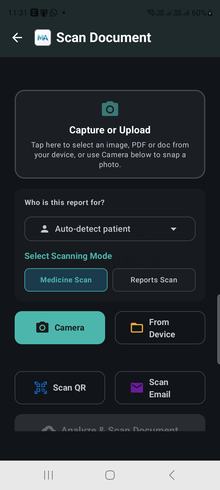 | 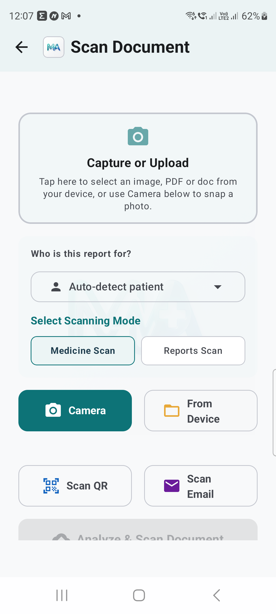 |

### 📄 Journey Screen 2: AI Extraction & Parameter Parsing (`Analysis & Report Detail Screen`)
Before walking into a medical consultation, tap **"Analyze & Scan"** on any document:
- Runs Google Gemini Vision AI + Indic Sarvam OCR to extract test parameters and flag out-of-range values.
- Automatically structures raw lab values — and every medicine on a discharge summary — into clean digital medical records.

| Dark theme | Light theme |
|---|---|
| 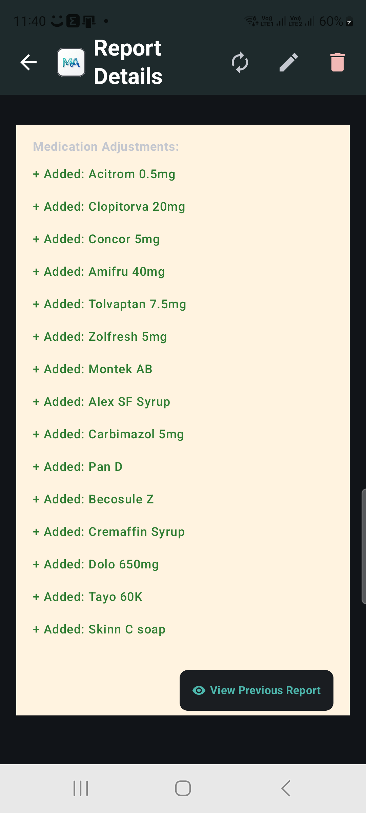 | 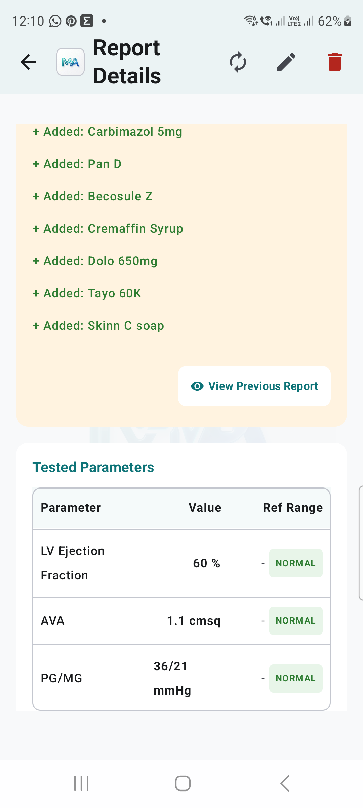 |

### 📈 Journey Screen 3: Longitudinal Biomarker Trends Chart (`Trends Screen`)
Visualizes long-term health metrics — from Blood Count and Diabetes to Coagulation (PT/INR), Electrolytes, Kidney & Liver, and Thyroid — over months or years:
- **On-Device Unit Standardization**: Converts mismatched lab reporting units (e.g., `mg/dL` to `mmol/L`) onto a single trend line.
- **Healthy Reference Range Bands**: Overlays normal reference range bands directly on trend graphs.
- **Test-Group Filter**: Jump straight to one panel (e.g. Coagulation) instead of scrolling every test ever recorded.

| Dark theme | Light theme |
|---|---|
| 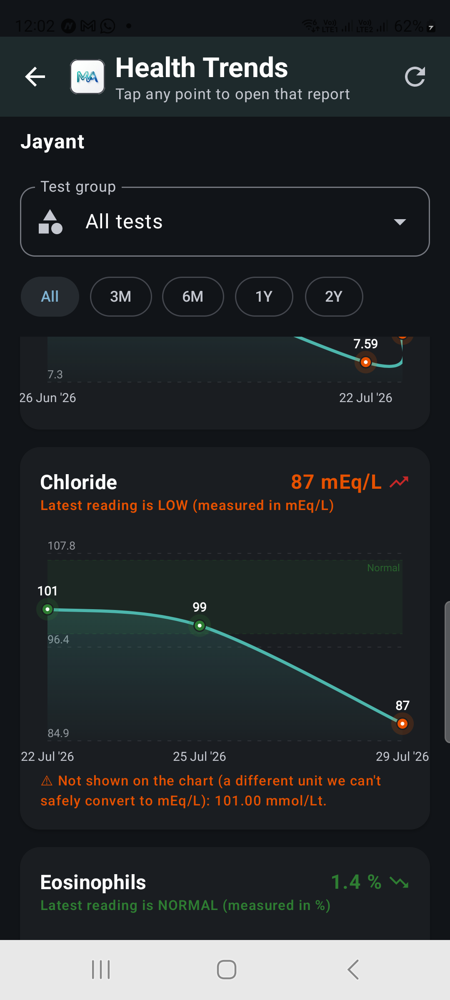 | 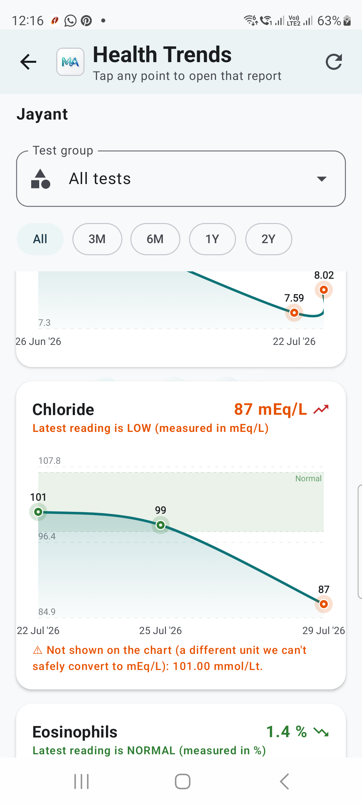 |

### 🏥 Journey Screen 4: 1-Page Doctor Brief & Consultation Summary (`Doctor Briefing Screen`)
Prepares caregivers for upcoming physician appointments and diagnostic follow-ups:
- Sectioned into a **Key Results** grid (color-coded High/Low status per test), an **Active Medication Schedule**, and a **Needs Attention** panel for abnormal findings — instead of one wall of text.
- Reads the brief aloud, and shows the next scheduled appointment pulled automatically from a scanned discharge summary's follow-up instructions.

| Dark theme | Light theme |
|---|---|
| 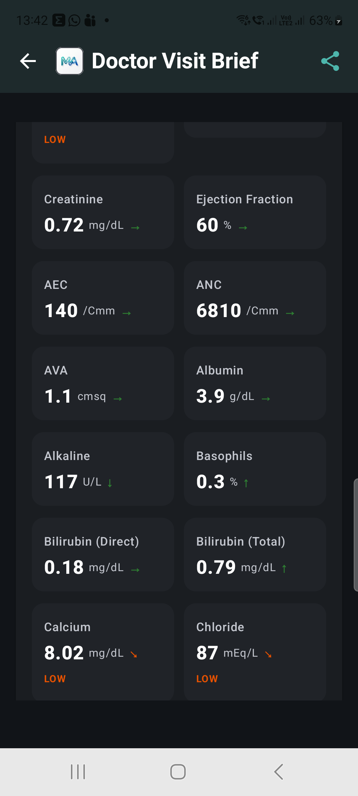 | 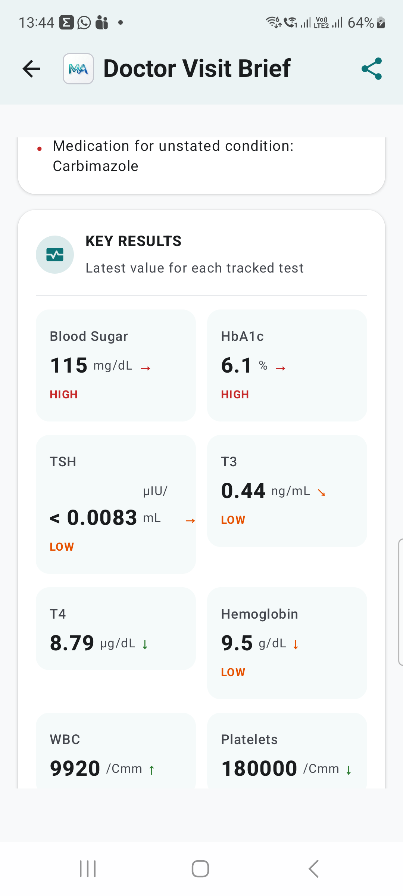 |

### ⏰ Journey Screen 5: Medication Reminders & Doctor Appointments
Eliminates missed or duplicate doses when multiple family members assist with care — Medication Reminders and Doctor Appointments are separate Home tiles so neither gets lost in the other:
- **Color-Coded Time Slots**: Organizes daily intake into Morning, Afternoon, Evening, and Night timelines, including weekly-only schedules (e.g. a twice-a-week medicine).
- **Tap to Learn**: Tap any medicine name for an AI-generated "why is this used" reference.

| Dark theme | Light theme |
|---|---|
| 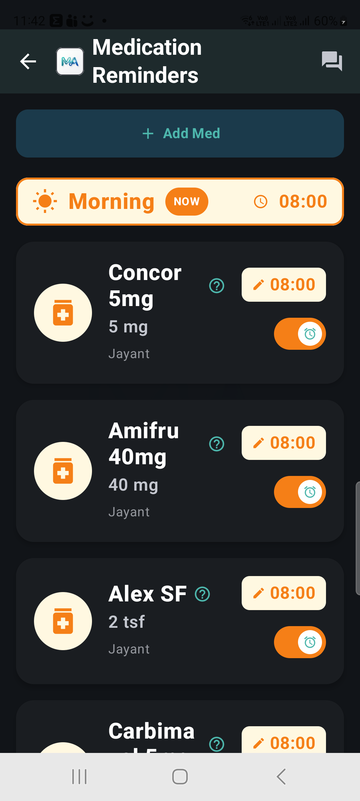 | 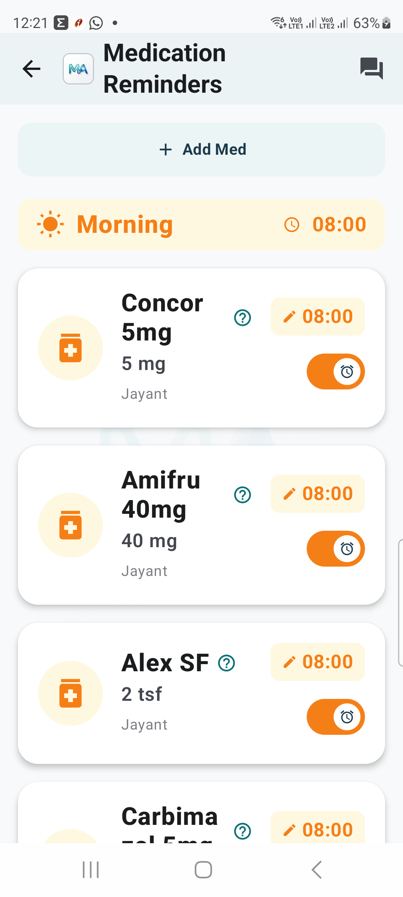 |

### 💬 Journey Screen 6: Medical Records Catalog & Per-Screen Contextual AI (`Records & AI Chat Screen`)
Centralized medical repository with context-scoped AI assistant:
- Browse archived health records by patient profile, complete with AI-generated Clinical Insights comparing each new report to the last, or open top-bar AI Chat to ask natural-language questions (e.g. *"Are there any active medicine interaction risks in today's reminders?"*) scoped specifically to active screen data.

| Dark theme | Light theme |
|---|---|
| 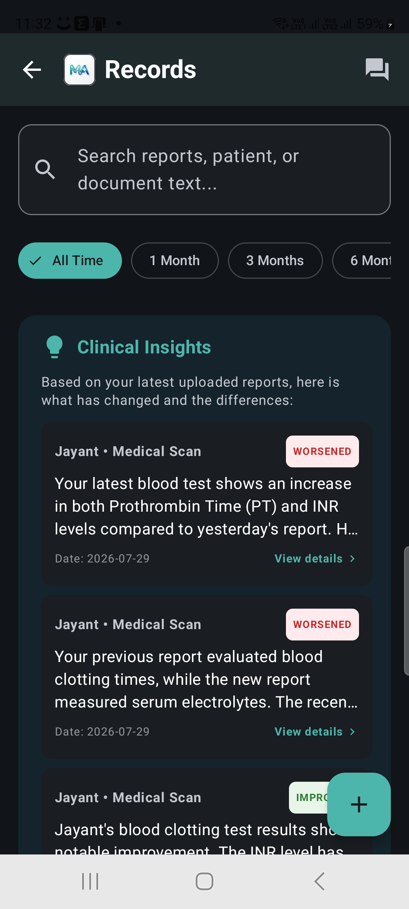 | 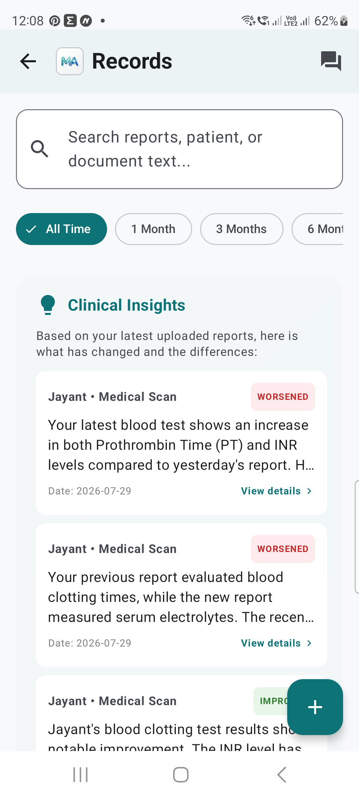 |

---

## 3. Product Evolution & Key Use Cases

- **Use Case 1: Multi-Channel Ingestion & Document Scanning**: Camera capture, Lab QR barcode reader, background Gmail PDF sync, zero-API archiving option.
- **Use Case 2: Medication Search, Tracking & Smart Reminders**: Auto-populates prescriptions, color-coded timelines, real-time intake logs, patient profile consolidation.
- **Use Case 3: Longitudinal Biomarker Trends & Unit Standardization**: On-device charting, dynamic unit conversion (`mg/dL` to `mmol/L`), healthy reference bands.
- **Use Case 4: AI Doctor Brief & Contextual Health Assistant**: 1-Page consultation summary, per-screen scoped AI assistant.

---

## 4. Technology Stack & System Architecture Summary

- **Android Mobile Client**: Kotlin, Jetpack Compose, Material 3, Room DB, WorkManager, CameraX, ML Kit.
- **Backend API Services**: Node.js / Express deployed on AWS Lambda via AWS SAM, connected to a Neon Postgres database.
- **AI & Integration Services**: Google Gemini 1.5 Flash Vision, Sarvam AI (Indic OCR & Translation), Firebase Auth.

### System Architecture Diagram
The architecture is designed to be privacy-first and offline-capable, combining an Android frontend with serverless backend microservices:

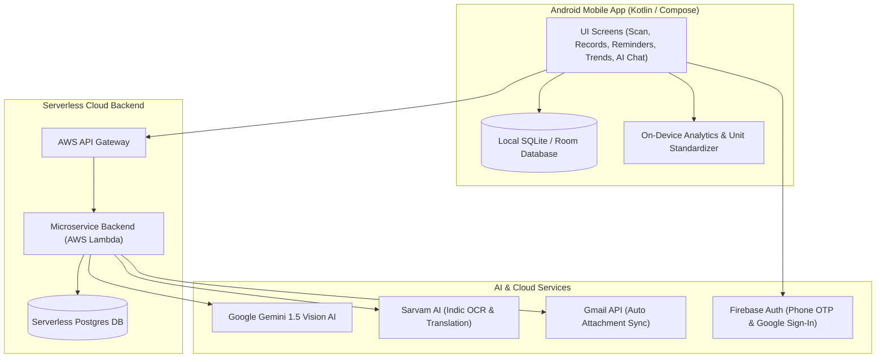

### End-to-End Processing Sequence Diagram
Below is the sequence flow when a document or prescription is ingested into the system:

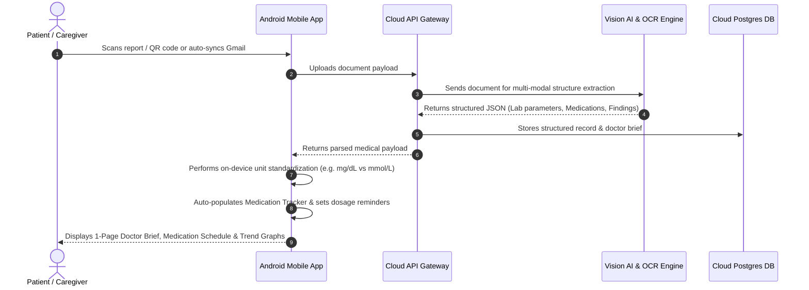

---

## 5. Accelerating Development with AI Coding Assistants

Building a full-stack system spanning an Android app (Jetpack Compose, Room, CameraX, WorkManager), a serverless cloud backend (AWS Lambda, Express, Neon Postgres), and multi-modal AI pipelines single-handedly was a major undertaking. Leveraging AI coding tools acted as a key force multiplier throughout the build:

- **Rapid Interactive Prototyping**: Built an interactive HTML/CSS/JS sandbox prototype first (`mockup/index.html`) to validate all 13 application screens, UI component tokens, and user flows before writing Compose code.
- **Complex Domain Math & Logic**: Accelerated building the on-device unit conversion engine (standardizing conventional lab units like `mg/dL` to SI units like `mmol/L`).
- **Full-Stack System Alignment**: Streamlined API contract definitions between the Kotlin Android client and Node.js AWS Lambda backend, enabling smooth database migrations.
- **Background Pipeline Implementation**: Simplified complex Android WorkManager tasks (e.g., daily Gmail report attachment sync) and CameraX ML Kit barcode scanning.

---

## 6. Access & Codebase

HealthDecoder is currently hosted in a **private GitHub repository** as development and testing continue.

If you are a developer, healthcare professional, or fellow caregiver interested in trying the app, reviewing the architecture, or requesting access:

🔗 **GitHub Repository**: [github.com/bhagwatshree/HealthDecoder](https://github.com/bhagwatshree/HealthDecoder)  
📬 **Request Access**: Visit the repository link above to submit an access request directly, or reach out on LinkedIn for a demo build!
